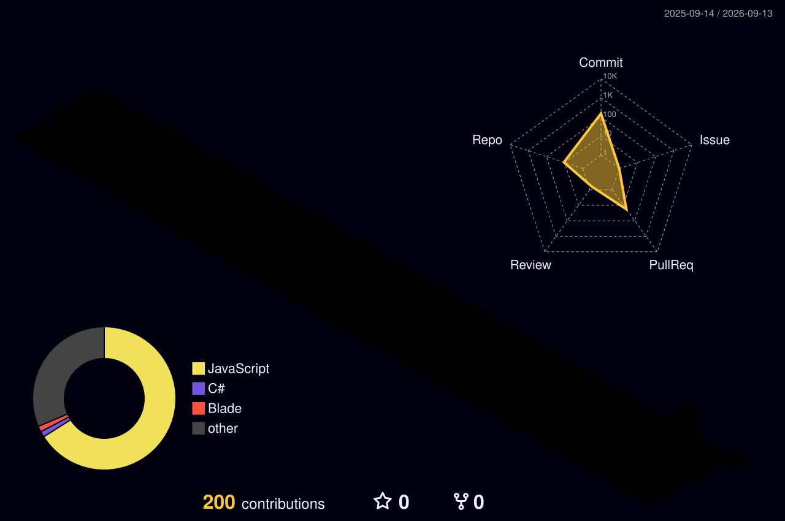

 

> Computer Science student at NUML Islamabad, currently in my 6th semester with a 3.94 CGPA, focused on full-stack development, backend engineering, API design, databases, and cloud-based applications.

 

 

## About Me

<table>
<tr>
<td width="85%">

Computer Science undergraduate at **NUML Islamabad** with a passion for building complete, scalable web applications. I thrive at the intersection of frontend design and backend engineering, constantly exploring how professional systems are built, deployed, and maintained.

- **6th Semester** | CGPA: **3.94**
- Currently deepening expertise in **backend architecture** and **API design**
- Learning **cloud deployment**, **database architecture**, and **modern DevOps**
- Interested in **scalable systems**, **developer tooling**, and **production-ready applications**

</td>
<td width="15%" align="center" valign="middle">

</td>
</tr>
</table>

 

 

 

## Tech Stack

<table>
<tr>
<td align="center" width="25%">

**Frontend**

</td>
<td align="center" width="25%">

**Backend**

</td>
<td align="center" width="25%">

**Databases**

</td>
<td align="center" width="25%">

**Tools**

</td>
</tr>
</table>

 

 

 

## What I Build

<table>
<tr>
<td width="50%">

### Full-Stack Applications
Modern responsive applications combining frontend interfaces with reliable backend systems.

### Data & Databases
Database-driven applications using SQL and NoSQL technologies.

</td>
<td width="50%">

### Backend & APIs
REST APIs, authentication, authorization, integrations, and backend architecture.

### Interactive Experiences
Modern interfaces, UI/UX experimentation, and interactive/3D web experiences.

</td>
</tr>
</table>

 

 

 

## Currently Exploring

 

 

 

## GitHub Stats

<table>
<tr>
<td width="66%">

 

</td>
<td width="34%" align="center" valign="middle">

</td>
</tr>
</table>

 

 

<table>
<tr>
<td width="66%">

</td>
<td width="34%" align="center" valign="middle">

</td>
</tr>
</table>

 

 

<table>
<tr>
<td width="50%" align="center">

</td>
<td width="50%" align="center" valign="middle">

</td>
</tr>
</table>

 

## Featured Projects

<table>
<tr>
<td width="50%">

### Qissa Clothing Store
A modern MERN e-commerce platform for women's ethnic fashion, featuring dynamic product browsing, cart and wishlist management, secure authentication, and Stripe payments.

`MongoDB` `Express` `React` `Node.js` `Stripe`

[View Project →](https://github.com/ayyanzubair729/Qissa-clothing-store)

</td>
<td width="50%">

### DoseNest
AI-Powered Medication Management system with WhatsApp reminders, helping users manage their health routines intelligently.

`Node.js` `AI` `WhatsApp API`

[View Project →](https://github.com/ayyanzubair729/DoseNest)

</td>
</tr>
<tr>
<td width="50%">

### DLMS
A professional Learning Management System with role-based dashboards for students, teachers, and administrators. Features course management, AI-powered quiz generation, real-time messaging, and certificate issuance.

`React` `Django` `PostgreSQL`

[View Project →](https://github.com/ayyanzubair729/DLMS)

</td>
<td width="50%">

### NeuroCare-AI
AI-Powered Healthcare Website providing intelligent, accessible, and user-friendly healthcare services through a modern web interface.

`React` `AI` `Healthcare`

[View Project →](https://github.com/ayyanzubair729/NeuroCare-AI)

</td>
</tr>
</table>

 

 

 

## Let's Connect

 

 

 

**Build · Learn · Create · Improve**

 

 

*Crafted with care by Ayyan Zubair*

